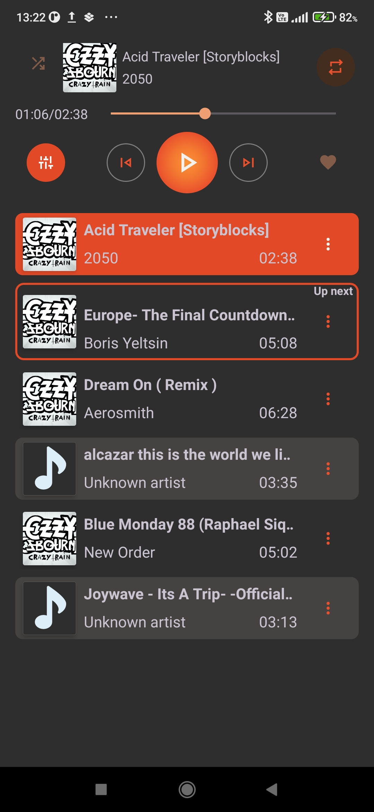
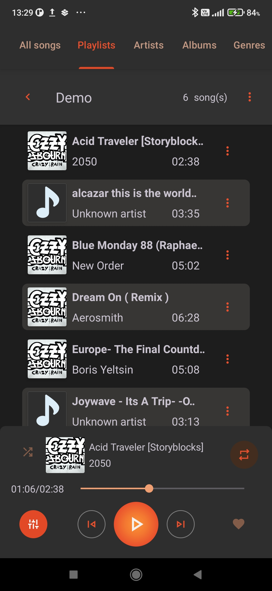
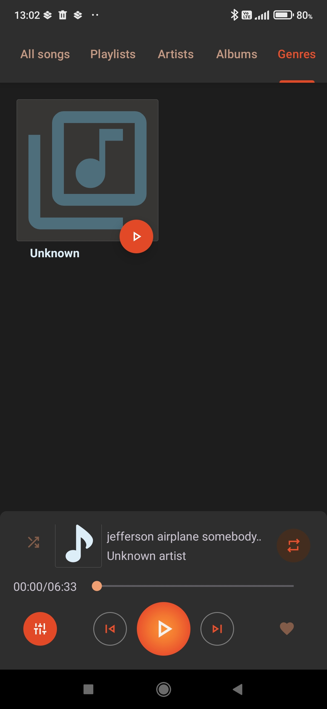

# MusicPlayer

### A simple yet feature-rich music player built for offline listening

## Current features

- **Automatic synchronization**: Synchronize the application with tracks on your device handling additions and removals automatically
- **Uninterrupted playback**: Seamless transitions between tracks ensuring a pleasant listening experience
- **Auto playlists**: Automatically create playlists like Added Recently or Favorites
- **Custom playlists**: Support for creating your own playlists besides "Auto" ones
- **Custom playback queue**: Modify the play queue by adding or removing track in real time, or select multiple songs to be played right after the current one
- **Bluetooth and headset support**: Control your playback via Bluetooth or wired headsets
- **Built-in equalizer**: Fine-tune the audio with customizable settings

## Screenshots

  
  
  
  
  
  
  
  
  
  

  

## Planned

- [ ] Support for organizing music by genres, artists and albums
- [ ] Lyrics display 
